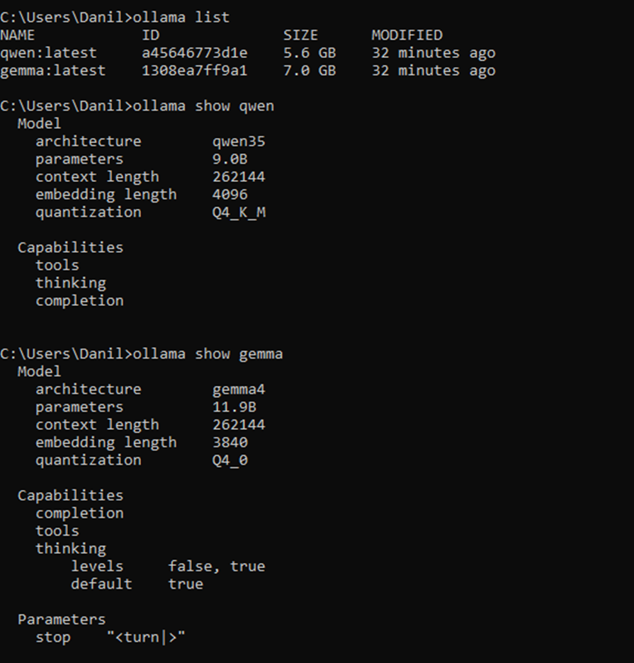
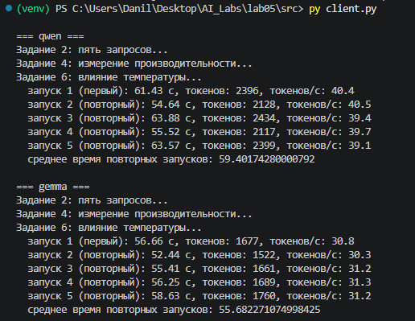
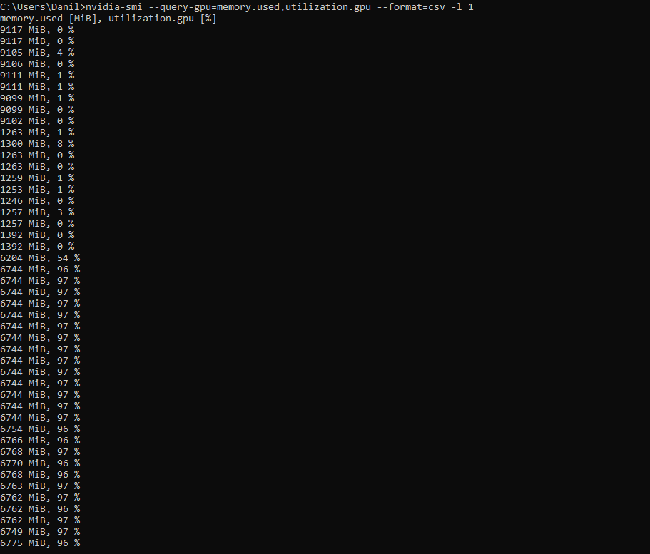
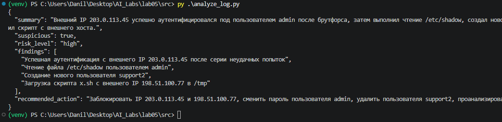

# ЛР5

**Цель работы**

Получить практические навыки развёртывания большой языковой модели на локальном компьютере, подключения к ней программного клиента через API, измерения требований к вычислительным ресурсам и производительности, а также сформировать понимание преимуществ, ограничений и рисков локального применения LLM.

**Описание моделей**

Qwen3.5 — это семейство больших языковых моделей от компании Alibaba Cloud, выпущенное в феврале 2026 года. Оно включает несколько вариантов с разным количеством параметров (от 0.8B до 397B), что позволяет подобрать решение под конкретные задачи: от запуска на ноутбуке до работы с огромными массивами данных в облаке.

Gemma 4 — это четвёртое поколение семейства открытых мультимодальных больших языковых моделей (LLM) от Google DeepMind. Её выпустили 2 апреля 2026 года. Модель построена на тех же исследованиях и технологиях, что и закрытая флагманская модель Gemini, но в отличие от неё Gemma 4 распространяется с открытыми весами под разрешительной лицензией Apache 2.0, что позволяет свободно использовать её в коммерческих целях, модифицировать и распространять.

В работе используются Gemma-4-12B-it-QAT (основная модель, задания 1–6) и Qwen3.5-9B (вторая модель, задание 7). Обе модели запускаются в Ollama. Режим размышления задаётся параметром THINK в .env: отключён (THINK=false), для обеих моделей одинаково.

**Конфигурация компьютера**

| Параметр | Значение |
| --- | --- |
| Операционная система | Windows 11 LTSC IoT |
| Процессор | AMD Ryzen 5 5600 |
| Количество ядер / потоков | 6 / 12 |
| Оперативная память, ГБ | 32 |
| GPU | NVIDIA GeForce GTX 1080 Ti |
| Видеопамять, ГБ | 11 |
| Свободное место на диске, ГБ | 60 |

**Выбор модели и конфигурации**

Видеопамяти 11 ГБ достаточно для 4-битных вариантов обеих моделей целиком на GPU. Грубая оценка (не измерение): веса 12B-модели в 4-битном формате занимают около 7–8 ГБ, 9B-модели — около 5–6 ГБ, и ещё нужна память под кэш внимания, который растёт с длиной контекста. Поэтому длина контекста в Ollama не увеличивалась без необходимости. 60 ГБ свободного места хватает на файлы весов обеих моделей. Фактические размеры файлов и варианты квантования указаны в задании 1.

**Способ доступа**

Ollama и Python-клиент запущены на одном компьютере (Windows 11). Клиент обращается к локальному серверу Ollama по адресу http://localhost:11434 через HTTP API. Сервер слушает только локальный интерфейс (127.0.0.1).

**Запуск**

Установить зависимости:
```
python -m venv .venv
.venv\Scripts\activate
pip install -r requirements.txt
```
Создать .env на основе примера и указать реальные значения:
```
copy .env.example .env
```
Установить Ollama, проверить версию и загрузить обе модели:
```
ollama --version
ollama pull <имя_модели>
ollama list
```
Проверить, что сервер работает и модели доступны:
```
curl http://localhost:11434/api/tags
```
Запуск измерений (задания 2, 4, 6 для обеих моделей):
```
python src\client.py
```
Запуск индивидуального задания (анализ журнала событий):
```
python src\analyze_log.py
python src\analyze_log.py путь\к\другому_журналу.log
```

**Переменные окружения**
```
OLLAMA_URL=     # адрес сервера Ollama, по умолчанию http://localhost:11434
MODEL_1=        # имя основной модели из ollama list
MODEL_2=        # имя второй модели для задания 7 из ollama list
TEMPERATURE=    # температура для заданий 2-4 и индивидуального (0.2)
MAX_TOKENS=     # лимит длины ответа (3000)
THINK=          # режим размышления: true / false
```
**Результаты**

в results/: results.json (все ответы и замеры), benchmark.csv (таблица заданий 4), examples.md (ответы на запросы и температуры), analysis.json (индивидуальное задание).

**Структура**
```
lab05/
├── .env.example
├── prompts.json
├── requirements.txt
├── README.md
├── src/
│   ├── client.py
│   └── analyze_log.py
├── data/
│   └── sample_auth.log
├── results/
│   ├── results.json
│   ├── benchmark.csv
│   ├── examples.md
│   └── analysis.json
└── screenshots/
```

1. запросы, промпты, температуры и параметры замеров хранятся в prompts.json;
2. client.py измеряет полное время ответа, а число выходных токенов, время генерации и время загрузки модели берёт из ответа Ollama (поля eval_count, eval_duration, load_duration); скорость = eval_count / eval_duration; если сервер вернул ошибку, запрос повторяется один раз;
3. первый запуск в задании 4 отмечается отдельно от повторных;
4. файлы весов моделей в репозитории не хранятся;
5. токены и секреты в репозиторий не попадают.

**Ход работы**

**Задание 1. Выбор и загрузка модели**

| Параметр | Основная модель | Вторая модель |
| --- | --- | --- |
| Название | Gemma-4-12B-it-QAT | Qwen3.5-9B |
| Размер класса | 12B | 9B |
| Вариант квантования | Q4_0 | Q4_K_M |
| Размер файла, ГБ | 6.49 | 5.24 |
| Среда выполнения (название и версия) | Ollama 0.40.2 | Ollama 0.40.2 |

Фактические данные о модели (размер, квантование) можно получить командой `ollama show <имя_модели>`.



**Задание 2. Первый локальный диалог**

Пять запросов разных типов (текст запросов — в prompts.json, ответы — в results/examples.md):

| № | Тип запроса | Запрос | Корректность: Gemma-4-12B-it-QAT | Корректность: Qwen3.5-9B |
| --- | --- | --- | --- | --- |
| 1 | фактологический | Объясни в 5 предложениях разницу между хэшированием и шифрованием. | Верно: 5 предложений (с вводной фразой и нумерацией), различие обратимости и назначения указано правильно. | Частично: 5 предложений, но в четвёртом ошибка: сказано, что хэш может вычислить только владелец исходных данных, хотя хэш вычисляет любой, у кого есть данные. |
| 2 | суммаризация | Суммаризируй следующий текст в 3 пунктах: (короткий текст про межсетевой экран, см. prompts.json) | Верно: 3 пункта, смысл исходного текста сохранён. | Верно: 3 пункта, смысл сохранён. |
| 3 | классификация | Определи категорию события: «пять неуспешных входов, затем успешный вход с нового IP». Ответ: норма / подозрительно / инцидент и краткое объяснение. | Верно: «подозрительно»; модель отмечает, что компрометация не доказана, и рекомендует проверку. | Частично: выбрана категория «инцидент» (компрометация считается подтверждённой, хотя данных для этого нет); в объяснении лишняя и неуместная ссылка на принцип наименьших привилегий. |
| 4 | структурированный ответ | Верни JSON с полями risk_level, reason, recommended_action для события: «пять неуспешных входов, затем успешный вход с нового IP». | Частично: JSON корректный, но обёрнут в блок ```json, хотя просили только JSON; значения на английском. | Верно: чистый JSON, все три поля, значения на русском. |
| 5 | код | Напиши функцию Python, проверяющую, содержит ли строка IPv4-адрес. | Верно: два рабочих варианта (через ipaddress и регулярное выражение), примеры соответствуют коду; модель сама указала ограничение разбиения на слова. | Верно: рабочее регулярное выражение с проверкой диапазона 0–255; неточность в описании (сказано про разбиение на слова, в коде его нет). |

Время ответа на запрос при отключённом размышлении: от 2.8 до 25.2 с (результаты в results/examples.md и results/results.json).



**Задание 3. Работа через локальный API**

Ollama предоставляет локальный HTTP API, поэтому вызов выполняется обычным POST-запросом (в src/client.py функция ask, ниже её упрощённая версия):
```
import time
import requests

MODEL = "<имя_модели>"
URL = "http://localhost:11434/api/chat"
payload = {
    "model": MODEL,
    "messages": [{"role": "user", "content": "Объясни принцип наименьших привилегий в ИБ."}],
    "stream": False,
}

t0 = time.perf_counter()
r = requests.post(URL, json=payload, timeout=900)
r.raise_for_status()
data = r.json()
dt = time.perf_counter() - t0
print(data["message"]["content"])
print(f"Время: {dt:.2f} с, токенов: {data['eval_count']}")
```
Вместо <имя_модели> подставляется имя из MODEL_1 (.env). Полный рабочий код — в src/client.py.

**Задание 4. Измерение производительности**

Запрос «Объясни принцип наименьших привилегий в ИБ.» выполнен 5 раз для каждой модели, данные в results/benchmark.csv. Скорость генерации = число сгенерированных токенов / время генерации (по данным Ollama). Время загрузки модели в память записано в отдельном столбце results/benchmark.csv. Замеры выполняются после задания 2, поэтому к первому запуску модель уже загружена в память (по данным Ollama время загрузки в столбце benchmark.csv равно 0); загрузка модели наблюдалась только при самом первом запросе задания 2 (около 3.1 с у Qwen3.5-9B и 5.0 с у Gemma-4-12B-it-QAT, см. results/results.json).

Таблица 1. Основная модель (Gemma-4-12B-it-QAT)

| № | Первый/повторный запуск | Время ответа, с | Выходных токенов | Токенов/с |
| --- | --- | --- | --- | --- |
| 1 | первый | 33.82 | 1022 | 30.38 |
| 2 | повторный | 28.67 | 866 | 30.38 |
| 3 | повторный | 31.32 | 944 | 30.30 |
| 4 | повторный | 28.63 | 883 | 31.03 |
| 5 | повторный | 29.85 | 896 | 30.18 |

Среднее время повторных запусков: 29.62 с.

Таблица 1а. Вторая модель (Qwen3.5-9B)

| № | Первый/повторный запуск | Время ответа, с | Выходных токенов | Токенов/с |
| --- | --- | --- | --- | --- |
| 1 | первый | 17.91 | 727 | 40.91 |
| 2 | повторный | 22.23 | 903 | 40.80 |
| 3 | повторный | 21.91 | 890 | 40.83 |
| 4 | повторный | 20.82 | 838 | 40.42 |
| 5 | повторный | 19.72 | 812 | 41.38 |

Среднее время повторных запусков: 21.17 с.

Объяснение различия между первым и последующими запросами: систематической разницы нет. У Gemma первый запуск самый долгий (33.82 с против 28.63–31.32 с), у Qwen самый короткий (17.91 с против 19.72–22.23 с). Время загрузки модели во всех пяти запусках равно 0, так как модель уже была загружена при выполнении задания 2, а скорость генерации почти не меняется (около 30.3 токена/с у Gemma и около 40.9 токена/с у Qwen). Разброс времени объясняется длиной ответа: у Gemma первый ответ был самым длинным (1022 токена), у Qwen первый ответ самым коротким (727 токенов). Заметное влияние загрузки наблюдалось только на самом первом запросе задания 2: он занял на 3–5 секунд больше (время загрузки 3.1 с у Qwen и 5.0 с у Gemma).

**Задание 5. Наблюдение за ресурсами**

Измерения выполняются во время запуска client.py: RAM, CPU и VRAM — в диспетчере задач (вкладка «Производительность»), GPU и VRAM — командой:
```
nvidia-smi --query-gpu=memory.used,utilization.gpu --format=csv -l 1
```

Таблица 2. Использование ресурсов

| Показатель | Qwen3.5-9B, до запуска | Qwen3.5-9B, после запуска | Qwen3.5-9B, во время генерации | Gemma-4-12B-it-QAT, до запуска |Gemma-4-12B-it-QAT, после запуска | Gemma-4-12B-it-QAT, во время генерации |
| --- | --- | --- | --- | --- | --- | --- |
| RAM, ГБ | 11.4 | 14.0 | 12.3 | 11.3 | 12.5 | 14.3 |
| Загрузка CPU, % | 12 | 12 | 12 | 12 | 12 | 12 |
| VRAM, ГиБ | 1.1 | 6.5 | 6.5 | 1.2 | 8.8 | 8.8 |
| Загрузка GPU, % | 0 | 0 | 97 | 0 | 0 | 95 |



**Задание 6. Влияние параметров генерации**

Творческий запрос «Придумай короткую историю (4-5 предложений) о системном администраторе, который ночью обнаруживает странную активность на сервере.» выполнен при температурах 0.2, 0.8 и 1.4 по два раза (ответы в results/examples.md).

Таблица 3. Влияние температуры

| Температура | Модель | Краткое описание результата | Разнообразие | Ошибки/галлюцинации |
| --- | --- | --- | --- | --- |
| низкая (0.2) | Gemma-4-12B-it-QAT | Две мистические истории с общей схемой: гул серверной, утечка данных в неизвестную точку, финальное сообщение или аномалия. Объём 5 предложений. | Низкое: оба запуска похожи по сюжету и началу | Нет |
| средняя (0.8) | Gemma-4-12B-it-QAT | Та же схема: гул, шаги в пустом коридоре, курсор печатает сообщение или кто-то наблюдает. Объём 5 предложений. | Низкое: один и тот же набор образов, как при 0.2 | Нет |
| высокая (1.4) | Gemma-4-12B-it-QAT | Снова гул вентиляторов, самодвижущийся курсор, шаги в пустом здании. | Низкое: истории по-прежнему близки между собой | Во втором запуске искажённое слово «наISS систему» (сбой генерации) |
| низкая (0.2) | Qwen3.5-9B | Реалистичные истории: администратор (Алексей, Иван) блокирует порт, находит ботнет или вредоносное ПО. Объём 5 предложений. | Среднее: разные имена и сюжеты | Нет явных, но концовки формальные |
| средняя (0.8) | Qwen3.5-9B | Сюжеты уходят в абсурд: «программа для поиска кота», кот на серверной стойке; вторая история с чужим отпечатком пальца и противоречивой развязкой. | Высокое | Логические несостыковки и придуманные детали, не вытекающие из условия |
| высокая (1.4) | Qwen3.5-9B | Тексты теряют связность: слово «alarms» на английском, неверное согласование («администратора Дмитрий»), несуществующее слово «Вскрошив», концовка про искусственный интеллект не связана с началом. | Высокое | Грамматические ошибки, искажённые слова, нарушена логика |

С ростом температуры Qwen3.5-9B заметно теряет связность и точность языка, а Gemma-4-12B-it-QAT остаётся устойчивой, но почти не меняет сюжет.

**Задание 7. Сравнение двух локальных моделей**

Те же пять запросов (задание 2) выполнены для второй модели; ответы и замеры в results/examples.md и results/results.json.

Таблица 4. Сравнение моделей

| Критерий | Gemma-4-12B-it-QAT | Qwen3.5-9B |
| --- | --- | --- |
| Размер/класс | 12B, файл 6.49 ГБ | 9B, файл 5.24 ГБ |
| Квантование | Q4_0 | Q4_K_M |
| RAM/VRAM | RAM при генерации 14.3 ГБ (рост на 3.0 ГБ), GPU 95 %; VRAM см. примечание к заданию 5 | RAM при генерации 14.0 ГБ (рост на 2.6 ГБ), GPU 97 %; VRAM см. примечание к заданию 5 |
| Среднее время | 29.62 с (повторные запуски задания 4); 9.8 с (5 запросов задания 2); около 30.5 токенов/с | 21.17 с (повторные запуски задания 4); 7.1 с (5 запросов задания 2); около 40.9 токенов/с |
| Качество на тесте | 4 запроса из 5 решены верно, 1 частично (запрос 4: JSON в блоке ```json и на английском) | 3 запроса из 5 решены верно, 2 частично (ошибка в объяснении хэширования; завышенная категория «инцидент») |
| Итоговое назначение | Более аккуратные и осторожные ответы: классификация, объяснения, код; нестабильность по температуре ниже | Быстрее и с чистым форматом JSON; подходит для коротких структурированных ответов, но требует проверки фактов и не рекомендуется при высокой температуре |

Qwen3.5-9B генерирует токены быстрее и меньше по размеру, поэтому отвечает быстрее при близкой длине ответа. Gemma-4-12B-it-QAT в этом тесте дала меньше ошибок по содержанию.

**Индивидуальное задание**

Сценарий: анализ фрагментов журналов событий. Прототип src/analyze_log.py читает файл журнала (по умолчанию data/sample_auth.log), передаёт его модели MODEL_1 с системной инструкцией (в prompts.json, ключ log_system) и выводит результат в формате JSON: краткий итог, признак подозрительной активности, уровень риска, список наблюдений и рекомендуемое действие. Результат сохраняется в results/analysis.json. Журнал data/sample_auth.log синтетический: в нём перебор паролей с одного адреса, успешный вход, чтение /etc/shadow, создание пользователя и загрузка скрипта.

Запуск:
```
python src\analyze_log.py
```
Результат работы (модель qwen, MODEL_1 в .env; файл results/analysis.json):
```
{
  "summary": "Обнаружена успешная аутентификация с внешнего IP-адреса, последующее чтение файла /etc/shadow, загрузка и сохранение подозрительного скрипта из внешнего источника, а также создание нового системного пользователя.",
  "suspicious": true,
  "risk_level": "high",
  "findings": [
    "Успешный вход пользователя admin с внешнего IP 203.0.113.45 после серии неудачных попыток подбора пароля",
    "Выполнение команды sudo для чтения содержимого /etc/shadow пользователем admin",
    "Загрузка файла x.sh с внешнего хоста 198.51.100.77 и сохранение его в /tmp",
    "Создание нового пользователя support2 с UID 1005"
  ],
  "recommended_action": "Немедленно заблокировать IP-адреса 203.0.113.45 и 198.51.100.77, удалить файл /tmp/x.sh, проверить и удалить пользователя support2, а также провести расследование действий пользователя admin."
}
```
Оценка результата: модель верно выделила цепочку, все четыре наблюдения подтверждаются строками журнала (адреса, UID 1005, путь /tmp), ответ - корректный JSON с нужными полями на русском языке.



Локальное размещение предпочтительно в этом сценарии: журналы событий содержат внутренние адреса, имена учётных записей и сведения об инфраструктуре, то есть служебную информацию. При локальном инференсе эти данные не покидают компьютер, их не нужно передавать стороннему провайдеру, и анализ работает без Интернета. Недостатки: качество и скорость ограничены локальным оборудованием, а проверка выводов модели остаётся за аналитиком.

**Вывод**

Обе локальные модели запускаются на видеокарте GTX 1080 Ti с 11 ГБ: загрузка GPU во время генерации составила 95–97 %, в отдельном замере видеопамяти nvidia-smi показал около 6.6–6.8 ГиБ. Скорость генерации у Qwen около 41 токена/с, у Gemma около 30 токенов/с. Короткие запросы выполняются за 3–11 с, ответ на вопрос с развёрнутым объяснением занимает 18–34 с, а запрос на код около 20–25 с. Время ответа определяется главным образом длиной ответа, а не загрузкой модели: после первого запроса модель остаётся в памяти.

По качеству на пяти тестовых запросах Gemma-4-12B-it-QAT решила четыре задачи верно и одну частично (формат JSON в запросе 4), Qwen3.5-9B решила верно три, а две частично: в объяснении хэширования допущена фактическая ошибка, а в классификации выбрана завышенная категория «инцидент». Qwen лучше соблюдает требование «только JSON». Параметр температуры сильно влияет на Qwen: при 0.8 и 1.4 тексты становятся абсурдными и содержат грамматические ошибки, тогда как Gemma остаётся связной, но почти не меняет сюжет. В индивидуальном задании модель корректно выделила в журнале подозрительную цепочку. Локальное размещение здесь оправдано: журналы содержат служебные данные и не покидают компьютер.

Исследованные модели пригодны для классификации событий, суммаризации коротких текстов, структурирования данных и первичного разбора журналов с проверкой человеком; для задач с высокой ценой ошибки их ответы нужно проверять, так как были фактическая ошибка и завышенная категория. Ограничения исследования: измерялась одна конфигурация компьютера, режим размышления отключён, замеры производительности повторялись по 5 раз, пять тестовых запросов — малая выборка для выводов о качестве.

**Ответы на контрольные вопросы**

**1. Чем локальный инференс отличается от обращения к облачному API?**

При локальном инференсе вычисления выполняются на компьютере или сервере пользователя, а запросы и контекст не передаются внешнему провайдеру. При обращении к облачному API запрос уходит на серверы провайдера, который выполняет вычисления и обычно берёт плату за токены. Локальный вариант даёт контроль над данными и независимость от Интернета, но ограничен собственным оборудованием и требует самостоятельной настройки и сопровождения. Облачный вариант даёт доступ к самым мощным моделям без затрат на оборудование.

**2. Почему файл модели не равен готовому AI-приложению?**

Файл содержит только веса и параметры архитектуры. Чтобы получить чат или API, нужна среда выполнения, которая загружает веса в память, выполняет токенизацию и инференс на CPU/GPU, управляет памятью и контекстом и предоставляет интерфейс (например, HTTP API). Также нужны клиент, системная инструкция и обработка результата.

**3. Что означает число параметров модели?**

Число параметров — количество обучаемых числовых коэффициентов (весов) нейронной сети, например 8B означает около 8 миллиардов. Оно характеризует размер и потенциальную ёмкость модели. Чем больше параметров, тем, как правило, выше возможности модели и тем больше памяти и вычислений нужно для её работы. Однако качество зависит и от архитектуры, данных обучения и дообучения, поэтому число параметров не гарантирует качество.

**4. Для чего применяется квантование?**

Квантование уменьшает точность хранения весов (например, с 16 бит до 8 или 4 бит). За счёт этого файл модели и потребление памяти становятся меньше, а скорость генерации часто растёт, потому что за один такт из памяти читается меньше данных. Платой может быть небольшое снижение качества.

**5. Почему 4-битная модель может быть удобнее FP16 на персональном компьютере?**

Вес модели в 4 битах занимает примерно в четыре раза меньше места, чем в FP16. Поэтому более крупная модель помещается в ограниченную видеопамять или оперативную память потребительского компьютера, и её можно выгрузить на GPU целиком. Это даёт более высокую скорость, чем при частичной выгрузке на процессор, при умеренной потере качества.

**6. Какие ресурсы влияют на скорость локальной генерации?**

Скорость зависит от типа устройства (GPU обычно быстрее CPU), объёма и пропускной способности видеопамяти или оперативной памяти, мощности вычислительных блоков, размера и квантования модели, того, насколько модель выгружена на GPU, длины контекста, а также от скорости диска при загрузке модели и от настроек среды выполнения.

**7. Почему большой контекст увеличивает расход памяти?**

Для каждого токена контекста модель хранит ключи и значения механизма внимания (кэш внимания). Его объём растёт пропорционально длине контекста, поэтому при длинном диалоге памяти требуется заметно больше, чем при коротком, и модель, которая запускалась на коротком контексте, может не поместиться в память на длинном. Кроме того, обработка длинного контекста замедляет генерацию.

**8. Что такое токен/с и что эта метрика показывает?**

Токен — единица текста, на которые модель разбивает вход и выход (часть слова, слово или знак). Токены/с — число сгенерированных токенов за секунду. Метрика показывает скорость генерации и позволяет сравнивать конфигурации независимо от длины ответа; на практике она определяет, насколько быстро пользователь увидит ответ.

**9. Почему первый запрос может выполняться медленнее последующих?**

Первый запрос может включать загрузку весов модели с диска в память (RAM или VRAM), инициализацию среды выполнения и прогрев кэшей. Последующие запросы используют уже загруженную модель, поэтому выполняются быстрее. Если модель была выгружена, например после смены другой модели или по таймеру простоя, медленным будет и следующий запрос.

**10. Какие данные остаются локально при локальном инференсе и какие действия всё равно могут потребовать Интернет?**

Локально остаются запросы пользователя, контекст, ответы модели и результаты. Интернет может потребоваться для скачивания среды выполнения и моделей, установки обновлений, проверки лицензий и каталога моделей, а также если среда имеет включённые функции телеметрии или подключённые внешние сервисы. Поэтому нужно проверять, какие компоненты обращаются наружу.

**11. Какие угрозы возникают, если локальный API открыт на внешний сетевой интерфейс без защиты?**

Любой, кто имеет доступ к сети, сможет использовать модель без аутентификации: расходовать ресурсы компьютера (отказ в обслуживании), отправлять запросы с вредоносными инструкциями, получать данные, находящиеся в контексте или системной инструкции, и использовать открытый сервер как точку входа для дальнейших атак. Поэтому API ограничивают интерфейсом localhost, межсетевым экраном и аутентификацией.

**12. В каких бизнес-сценариях локальная LLM предпочтительнее облачной?**

Когда данные конфиденциальны или регулируются требованиями (персональные данные, служебная информация, журналы событий ИБ, коммерческая тайна) и их нельзя передавать провайдеру; когда нужна работа без Интернета или в изолированном контуре; когда запросов много и стоимость токенов в облаке выше стоимости собственного оборудования; когда нужны предсказуемая задержка и полный контроль над версией модели.

**13. В каких случаях облачная модель может быть рациональнее локальной?**

Когда нужно максимальное качество на сложных задачах, которое недоступно небольшим моделям; когда нагрузка нерегулярная и покупка оборудования не окупается; когда нет возможности поддерживать инфраструктуру; когда требуется очень длинный контекст или мультимодальные возможности; когда данные не конфиденциальны и важнее скорость внедрения.

**14. Почему меньшая локальная модель не обязательно подходит для всех задач, даже если она быстрее?**

Меньшая модель обычно хуже справляется со сложными рассуждениями, длинными инструкциями, редкими знаниями и строгими форматами, чаще ошибается и галлюцинирует. Скорость и экономия ресурсов полезны только тогда, когда качество на конкретной задаче достаточно. Поэтому подходящую модель выбирают по измерениям на задаче, а не по размеру или скорости.

**15. Какие данные необходимо измерить, чтобы обоснованно сравнить две локальные модели?**

Качество на одном и том же тестовом наборе (точность, соблюдение формата, оценка ответов по рубрике), время ответа и скорость в токенах/с (отдельно первый и повторные запуски), потребление RAM и VRAM и загрузку CPU/GPU, размер модели и вариант квантования, длину контекста и параметры генерации. Условия для обеих моделей должны быть одинаковыми, а результаты желательно повторять несколько раз.
