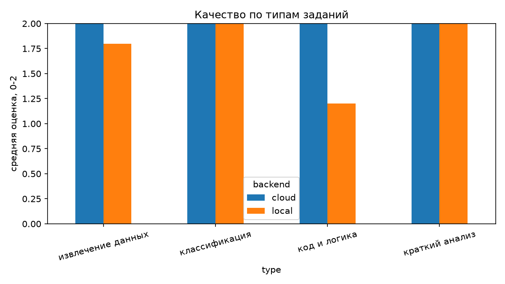
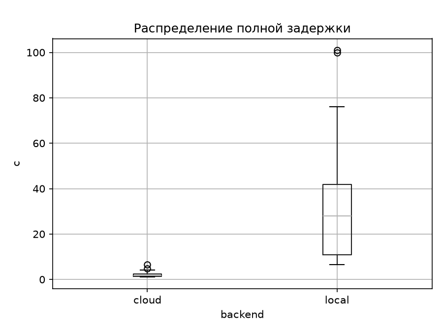
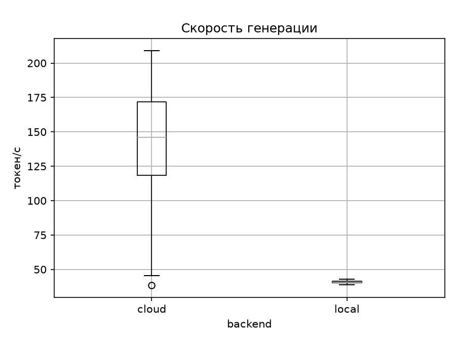

# ЛР6

**Цель работы**

Yаучиться обоснованно выбирать архитектуру применения большой языковой модели, сопоставляя качество ответа, задержку, пропускную способность, стоимость, требования к вычислительным ресурсам, приватность данных и эксплуатационные риски

**Описание моделей**

Qwen3.5 — это семейство больших языковых моделей от компании Alibaba Cloud, выпущенное в феврале 2026 года. Оно включает несколько вариантов с разным количеством параметров (от 0.8B до 397B), что позволяет подобрать решение под конкретные задачи: от запуска на ноутбуке до работы с огромными массивами данных в облаке.

Nemotron 3 Super (nvidia/nemotron-3-super-120b-a12b) — открытая гибридная модель NVIDIA на архитектуре Mamba-Transformer Mixture-of-Experts со 120 млрд параметров, из которых при генерации активны около 12 млрд. Модель использует мультитокенное прогнозирование (multi-token prediction), имеет контекстное окно в 1 млн токенов и ориентирована на агентные сценарии и сложные многошаговые задачи; веса, наборы данных и инструкции опубликованы по открытой лицензии NVIDIA. Используется бесплатный вариант (суффикс :free) через облачный сервис OpenRouter; запустить модель такого размера на обычном компьютере нельзя.

OpenRouter — облачный сервис-посредник, который предоставляет единый OpenAI-совместимый API к моделям разных поставщиков и публикует каталог моделей с ценами.

В работе сравниваются локальная модель Qwen3.5-9B (Q4_K_M, запускается в Ollama на компьютере) и облачная модель nvidia/nemotron-3-super-120b-a12b:free (доступ через OpenRouter). У локальной модели включён режим размышления (LOCAL_THINK=true), поэтому она перед ответом генерирует рассуждения, и они входят в число выходных токенов.

**Конфигурация компьютера**

| Параметр | Значение |
| --- | --- |
| Операционная система | Windows 11 LTSC IoT |
| Процессор | AMD Ryzen 5 5600 |
| Количество ядер / потоков | 6 / 12 |
| Оперативная память, ГБ | 32 |
| GPU | NVIDIA GeForce GTX 1080 Ti |
| Видеопамять, ГБ | 11 |
| Свободное место на диске, ГБ | 60 |
| Локальный сервер | Ollama (версия 0.40.2) |
| Локальная модель | Qwen3.5-9B, Q4_K_M, файл 5.24 ГБ |
| Облачная модель и поставщик | nvidia/nemotron-3-super-120b-a12b:free, OpenRouter |
| Дата эксперимента | 10.10.2026 |

**Способ доступа**

Локальная модель: Ollama на этом же компьютере, обращение по http://localhost:11434. Облачная модель: OpenRouter, обращение по https://openrouter.ai/api/v1 через библиотеку openai (OpenAI-совместимый API, потоковый режим). Для обеих моделей используется одна системная инструкция, одинаковые температура и лимит токенов.

**Запуск**

Все команды выполняются в корне проекта. Установить зависимости:
```
python -m venv .venv
.venv\Scripts\activate
pip install -r requirements.txt
```
Создать .env на основе примера и указать реальные значения:
```
copy .env.example .env
```
Убедиться, что локальная модель установлена и сервер Ollama работает:
```
ollama list
curl http://localhost:11434/api/tags
```
Запуск эксперимента (обе модели, все тесты, повторные запуски, сводные таблицы и графики):
```
python src\benchmark.py
```
Графики можно перестроить из сохранённых CSV отдельно:
```
python src\charts.py
```

**Переменные окружения**
```
CLOUD_API_KEY=      # ключ OpenRouter
CLOUD_BASE_URL=     # адрес API
CLOUD_MODEL=        # облачная модель, например nvidia/nemotron-3-super-120b-a12b:free
LOCAL_URL=          # адрес Ollama
LOCAL_MODEL=        # имя локальной модели из ollama list
LOCAL_THINK=        # режим размышления локальной модели: true / false
TEMPERATURE=        # температура, одинаковая для обеих моделей (0.2)
MAX_TOKENS=         # лимит длины ответа, одинаковый для обеих моделей (4000)
CLOUD_PRICE_IN=     # цена входных токенов, USD за 1 млн (для бесплатной модели 0)
CLOUD_PRICE_OUT=    # цена выходных токенов, USD за 1 млн (для бесплатной модели 0)
CLOUD_PAUSE_S=      # пауза между запросами к облаку, с (4): у бесплатных моделей есть лимит запросов
MAX_ATTEMPTS=      # число попыток запроса при ошибке сервиса, например перегрузке (5)
RETRY_PAUSE_S=     # базовая пауза между попытками, с (5, затем 10, 15...)
```
**Результаты**

в results/: raw_results.csv (все запросы, ответы и замеры), summary.csv (итоги по моделям), summary_by_type.csv (качество по типам заданий), repeats.csv (повторные запуски), config.json (параметры запуска и цена), графики *.png.

**Структура**
```
lab06/
├── .env.example
├── .gitignore
├── requirements.txt
├── README.md
├── src/
│   ├── benchmark.py
│   ├── providers.py
│   ├── metrics.py
│   └── charts.py
├── data/
│   └── test_cases.json
├── results/
│   ├── raw_results.csv
│   ├── summary.csv
│   ├── summary_by_type.csv
│   ├── repeats.csv
│   ├── config.json
│   └── *.png
└── screenshots/
```

1. тестовый набор (20 тестов, 4 типа) и системная инструкция хранятся в data/test_cases.json и одинаковы для обеих моделей;
2. providers.py содержит вызовы обеих моделей, которые возвращают одинаковый набор полей (ответ, время первого токена, полное время, токены);
3. оба вызова выполняются в потоковом режиме, поэтому измеряется время первого токена (TTFT); скорость генерации = выходные токены / (полное время − TTFT);
4. качество оценивается автоматически по критерию теста (шкала 0–2)
5. для локальной модели во время запроса раз в секунду снимаются CPU, RAM, VRAM и загрузка GPU (psutil, nvidia-smi), записываются максимумы;
6. цена облачной модели задаётся в .env (CLOUD_PRICE_IN, CLOUD_PRICE_OUT, USD за 1 млн токенов) и сохраняется в results/config.json; для бесплатной модели она равна 0;
7. при ошибке сервиса (например, «Service temporarily overloaded» у облачной модели) запрос повторяется до MAX_ATTEMPTS раз с растущей паузой; в таблицу попадает время успешной попытки, число попыток записано в столбце attempts, а число запросов с повторами — в summary.csv;
8. ключ OpenRouter хранится только в .env.

**Ход работы**

Сценарий: первичная обработка событий информационной безопасности (классификация событий, извлечение полей из сообщений, краткая оценка риска, поиск ошибки в коде). Все данные синтетические, реальные и персональные данные в облако не отправляются.

Параметры одинаковые для обеих моделей: температура 0.2, max_tokens 4000, у локальной модели включено размышление, одна и та же системная инструкция:

```
Ты аналитик по информационной безопасности. Отвечай точно и структурированно. Если просят JSON, верни только JSON без пояснений и без markdown-разметки.
```

Таблица 1. Тестовый набор (20 тестов, подробные формулировки — в data/test_cases.json)

| Тесты | Тип задания | Содержание | Критерий оценки (0–2) |
| --- | --- | --- | --- |
| 1–5 | классификация | Определить, обычное событие или подозрительное (normal / suspicious) | 2 — метка совпала с эталоном, иначе 0 |
| 6–10 | извлечение данных | Извлечь 5–6 полей из сообщения, заявки или записи журнала в JSON | 2 — все поля верны, 1 — верна половина и больше, 0 — иначе или некорректный JSON |
| 11–15 | краткий анализ | Оценить риск (low / medium / high) и предложить действие в JSON | 2 — риск совпал с эталоном и в рекомендации есть ключевое слово, 1 — выполнено одно из условий, 0 — иначе |
| 16–20 | код и логика | Найти строку с ошибкой в коротком фрагменте и описать её в JSON | 2 — номер строки верный и в описании есть ключевое слово, 1 — выполнено одно из условий, 0 — иначе |

Критерии проверяются программой (src/metrics.py), эталонные значения и ключевые слова заданы в data/test_cases.json. Ограничение: проверка по ключевым словам не распознаёт верный ответ, сформулированный другими словами, поэтому оценка для тестов 11–20 приближённая.

Пять тестов (№ 2, 8, 13, 17, 19) повторяются ещё по 3 раза для каждой модели; вместе с основным прогоном получается 4 замера задержки на тест.

Таблица 2. Сырые результаты (фрагмент results/raw_results.csv)

| test_id | model | latency_s | ttft_s | input_tok | output_tok | score | error |
| --- | --- | --- | --- | --- | --- | --- | --- |
| 1 | qwen | 15.70 | 5.62 | 114 | 416 | 2 | нет |
| 2 | qwen | 13.43 | 2.26 | 108 | 448 | 2 | нет |
| 3 | qwen | 10.86 | 2.28 | 127 | 347 | 2 | нет |
| 4 | qwen | 8.31 | 2.26 | 110 | 242 | 2 | нет |
| 5 | qwen | 6.47 | 2.24 | 109 | 165 | 2 | нет |
| 6 | qwen | 27.62 | 2.27 | 127 | 1077 | 2 | нет |
| 7 | qwen | 52.00 | 2.28 | 118 | 2017 | 2 | нет |
| 8 | qwen | 76.07 | 2.29 | 119 | 3038 | 1 | нет |
| 9 | qwen | 48.50 | 2.31 | 130 | 1907 | 2 | нет |
| 10 | qwen | 28.54 | 2.30 | 134 | 1064 | 2 | нет |
| 11 | qwen | 10.95 | 2.29 | 139 | 337 | 2 | нет |
| 12 | qwen | 38.06 | 2.27 | 121 | 1500 | 2 | нет |
| 13 | qwen | 7.99 | 2.27 | 117 | 244 | 2 | нет |
| 14 | qwen | 27.06 | 2.26 | 114 | 1046 | 2 | нет |
| 15 | qwen | 7.57 | 2.27 | 123 | 227 | 2 | нет |
| 16 | qwen | 99.91 | 2.29 | 131 | 4000 | 0 | нет |
| 17 | qwen | 35.59 | 2.32 | 115 | 1337 | 2 | нет |
| 18 | qwen | 101.08 | 2.29 | 127 | 4000 | 0 | нет |
| 19 | qwen | 37.38 | 2.28 | 110 | 1455 | 2 | нет |
| 20 | qwen | 39.65 | 2.26 | 104 | 1485 | 2 | нет |
| 1 | nemotron-3-super | 1.26 | 0.95 | 123 | 58 | 2 | нет |
| 2 | nemotron-3-super | 1.01 | 0.74 | 110 | 57 | 2 | нет |
| 3 | nemotron-3-super | 1.10 | 0.77 | 130 | 62 | 2 | нет |
| 4 | nemotron-3-super | 1.07 | 0.77 | 117 | 49 | 2 | нет |
| 5 | nemotron-3-super | 1.04 | 0.71 | 118 | 57 | 2 | нет |
| 6 | nemotron-3-super | 2.37 | 0.76 | 137 | 204 | 2 | нет |
| 7 | nemotron-3-super | 4.09 | 0.80 | 125 | 216 | 2 | нет |
| 8 | nemotron-3-super | 6.48 | 1.10 | 125 | 244 | 2 | нет |
| 9 | nemotron-3-super | 2.64 | 1.07 | 132 | 225 | 2 | нет |
| 10 | nemotron-3-super | 2.44 | 0.73 | 140 | 253 | 2 | нет |
| 11 | nemotron-3-super | 1.70 | 0.75 | 150 | 138 | 2 | нет |
| 12 | nemotron-3-super | 1.93 | 0.78 | 129 | 144 | 2 | нет |
| 13 | nemotron-3-super | 1.99 | 0.77 | 124 | 121 | 2 | нет |
| 14 | nemotron-3-super | 2.32 | 0.71 | 126 | 137 | 2 | нет |
| 15 | nemotron-3-super | 1.64 | 0.72 | 131 | 168 | 2 | нет |
| 16 | nemotron-3-super | 4.72 | 0.91 | 133 | 146 | 2 | нет |
| 17 | nemotron-3-super | 2.25 | 0.72 | 118 | 191 | 2 | нет |
| 18 | nemotron-3-super | 1.22 | 0.75 | 131 | 80 | 2 | нет |
| 19 | nemotron-3-super | 1.60 | 0.74 | 113 | 135 | 2 | нет |
| 20 | nemotron-3-super | 1.60 | 0.71 | 109 | 152 | 2 | нет |

Таблица 3. Итоговая сравнительная таблица

| Показатель | Локальная модель (Qwen3.5-9B) | Облачная модель (Nemotron 3 Super :free) | Победитель/комментарий |
| --- | --- | --- | --- |
| Средняя оценка качества (0–2) | 1.75 | 2.00 | Облако; у локальной два нуля из-за обрыва ответа по лимиту 4000 токенов (тесты 16 и 18) |
| Доля полностью корректных ответов | 85% (17 из 20) | 100% (20 из 20) | Облако |
| Средняя полная задержка, с | 34.64 | 2.22 | Облако в 15 раз быстрее (у локальной включено размышление) |
| Медианная задержка, с | 28.08 | 1.82 | Облако |
| Среднее время первого токена (TTFT), с | 2.45 | 0.80 | Облако |
| Скорость генерации, токен/с | 40.9 | 137.8 | Облако; у облака среднее по коротким ответам, разброс 25–368 |
| Входные токены (весь набор) | 2397 | 2521 | Разница из-за разных токенизаторов |
| Выходные токены (весь набор) | 26352 | 2837 | Локальная модель тратит в 9 раз больше токенов на рассуждения |
| Ошибки API | 0 | 0 | Повторных запросов не потребовалось (requests_with_retries = 0) |
| RAM/VRAM | RAM до 17.87 ГБ (всей системы), VRAM до 7060 МиБ | не используются | Облако не требует ресурсов компьютера |
| Стоимость набора, USD | нет платы за токены | 0 | Облако бесплатно (:free) |
| Стоимость 1 000 запросов, USD | нет платы за токены | 0 | У локальной есть затраты на оборудование и электроэнергию (не рассчитаны) |
| Работа без внешней сети | да | нет | Локальная |
| Риск передачи чувствительных данных | нет, данные остаются на компьютере | есть, запросы уходят поставщику | Локальная |

Таблица 4. Качество по типам заданий (results/summary_by_type.csv)

| Тип задания | Локальная модель | Облачная модель |
| --- | --- | --- |
| классификация | 2.00 | 2.00 |
| извлечение данных | 1.80 | 2.00 |
| краткий анализ | 2.00 | 2.00 |
| код и логика | 1.20 | 2.00 |

Таблица 5. Повторные измерения задержки (results/repeats.csv, 4 запуска на тест)

| Тест | Модель | Среднее, с | Стд. отклонение, с | Минимум, с | Максимум, с |
| --- | --- | --- | --- | --- | --- |
| 2 | Qwen3.5-9B | 11.68 | 1.94 | 8.94 | 13.43 |
| 8 | Qwen3.5-9B | 68.58 | 27.64 | 33.27 | 99.84 |
| 13 | Qwen3.5-9B | 14.42 | 8.17 | 6.82 | 22.67 |
| 17 | Qwen3.5-9B | 58.36 | 29.24 | 35.59 | 99.33 |
| 19 | Qwen3.5-9B | 28.46 | 6.48 | 22.27 | 37.38 |
| 2 | Nemotron 3 Super | 1.55 | 0.77 | 1.01 | 2.69 |
| 8 | Nemotron 3 Super | 3.48 | 2.00 | 2.39 | 6.48 |
| 13 | Nemotron 3 Super | 2.97 | 2.58 | 1.47 | 6.83 |
| 17 | Nemotron 3 Super | 3.74 | 1.85 | 2.12 | 5.83 |
| 19 | Nemotron 3 Super | 1.54 | 0.04 | 1.51 | 1.60 |

У облачной модели задержка стабильно 1–7 с (стд. 0.8–2.6 с). У локальной она колеблется сильнее, потому что при включённом размышлении длина ответа от запуска к запуску сильно меняется (например, тест 8: от 1300 до 4000 токенов). В повторных запусках оценки менялись: локальная модель получила 0 в тесте 8 (повтор 2) и в тесте 17 (повтор 3) из-за обрыва по лимиту, облачная получила 1 вместо 2 в тестах 17 (повтор 1) и 19 (все три повтора). Значит, даже при температуре 0.2 качество одного ответа не стабильно.

Единичный замер может быть искажён прогревом локальной модели и загрузкой её в память, сетевой задержкой и очередью у облачного поставщика, фоновой нагрузкой компьютера. Поэтому важен разброс при повторных запусках, а не одно значение.

Таблица 6. Расчёт стоимости облачной модели

Формула: C = Nвх · Pвх + Nвых · Pвых, где Nвх и Nвых — число входных и выходных токенов, Pвх и Pвых — цена токена. Выбранная облачная модель бесплатная (вариант :free), поэтому Pвх = Pвых = 0 и стоимость набора равна 0; формула и расчёт всё равно выполняются программой. Ограничения бесплатных моделей: лимит запросов в минуту и в сутки, возможное изменение условий и доступности, а также возможное использование запросов поставщиком.

| Параметр | Значение |
| --- | --- |
| Дата и источник тарифа (страница модели в OpenRouter) | 10.10.2026, вариант :free, цена 0 |
| Цена входных токенов, USD за 1 млн | 0 |
| Цена выходных токенов, USD за 1 млн | 0 |
| Стоимость тестового набора (20 запросов), USD | 0 |
| Средняя стоимость одного запроса, USD | 0 |
| Оценка 1 000 запросов, USD | 0 |
| Оценка 100 000 запросов, USD | 0 |

Облачная модель в этой работе бесплатна, но это не значит, что решение бесплатно: у неё есть лимиты и риск передачи данных. Локальная модель не требует оплаты токенов, но это не означает нулевую стоимость: нужны компьютер с видеокартой (амортизация), электроэнергия, обслуживание и обновление модели. Эксплуатационная стоимость в обязательной части не рассчитывалась; сопоставлены аппаратные требования (таблица 7).

Таблица 7. Ресурсы при работе локальной модели (максимумы за прогон, results/raw_results.csv)

| Показатель | Значение |
| --- | --- |
| Максимальная загрузка CPU, % | 42.6 |
| Максимальная занятая RAM, ГБ | 17.87 |
| Максимальная VRAM, МиБ | 7060 |
| Максимальная загрузка GPU, % | 98 |

Способ измерения: psutil (CPU, RAM компьютера целиком) и nvidia-smi (VRAM и GPU), опрос раз в секунду во время запроса; значения RAM относятся ко всей системе, а не только к процессу модели.

Графики (строятся из CSV скриптом src/charts.py):







**Анализ информационной безопасности**

Таблица 8. Данные и допустимость передачи в облачный сервис

| Категория данных | Допустимо отправлять в облако | Требуется обезличивание | Только внутри контролируемого периметра |
| --- | --- | --- | --- |
| Синтетические тестовые события и учебные примеры | да | нет | нет |
| Журналы событий с внутренними адресами и именами учётных записей | нет | да (заменить адреса, имена, названия хостов) | если обезличить нельзя |
| Персональные данные сотрудников и клиентов | нет | только с правовым основанием и обезличиванием | да |
| Пароли, ключи API, токены, сертификаты | нет | нет | да |
| Исходный код продукта, внутренние документы, коммерческая тайна | нет | при согласовании с владельцем | да |
| Публичная информация | да | нет | нет |

Техническая возможность отправить данные не означает правомерность такой передачи: она определяется политикой организации и условиями сервиса.

Таблица 9. Сравнение локальной и облачной архитектуры по безопасности и эксплуатации

| Фактор | Локальная | Облачная | Комментарий |
| --- | --- | --- | --- |
| Конфиденциальность данных | Данные остаются на компьютере | Запросы передаются через OpenRouter поставщику модели; у бесплатных моделей условия использования данных нужно проверять отдельно | Условия хранения и обработки определяются политикой сервиса, их нужно проверять отдельно |
| Контроль журналов | Журналы сервера Ollama и клиента под контролем владельца | Журналы ведёт поставщик, доступ ограничен | Клиентские журналы нужно проверять на наличие секретов |
| Управление ключами доступа | Ключ не нужен, API закрыт на localhost | Нужен ключ OpenRouter, его нужно хранить в .env и ограничивать по сроку и лимиту | Утечка ключа ведёт к чужим расходам; ключ отзывается и перевыпускается |
| Доступность без Интернета | Работает | Не работает | Для облака нужна сеть и доступность поставщика |
| Зависимость от поставщика | Низкая (открытые веса) | Высокая: цены, лимиты, доступность и состав моделей меняются | Нужна возможность смены модели |
| Контроль версии модели | Файл модели фиксирован | Версия определяется поставщиком | Название и дата эксперимента фиксируются в отчёте |
| Обновления и исправления | Обновляет сам владелец | Обновляет поставщик, возможна смена поведения модели | В облаке поведение может измениться без участия пользователя |
| Аудит и трассировка запросов | Полный, на стороне владельца | Ограничен тем, что предоставляет сервис | Для аудита сохраняются сырые ответы и параметры запроса |

**Матрица выбора архитектуры**

| Сценарий | Ключевые требования | Рекомендуемая архитектура | Обоснование |
| --- | --- | --- | --- |
| Внутренние документы ИБ | Высокая конфиденциальность, умеренная нагрузка | Локальная | Данные не покидают периметр; нагрузка умеренная, а задержка 30 с с размышлением для внутренней работы допустима, без размышления — около 3 с |
| Публичный помощник сайта | Высокое качество, переменная нагрузка | Облачная | Данные публичные; облако ответило за 2 с на 20 из 20 верно, масштабируется при росте нагрузки; бесплатный уровень для продакшена не подходит из-за лимитов, нужен платный тариф |
| Массовая классификация заявок | Низкая цена, стабильный формат | Локальная без размышления (при публичных или обезличенных данных допустима и облачная) | Классификацию обе модели выполнили на 2.00; платы за токены у локальной нет; размышление для этой задачи не нужно и только замедляет |

**Вывод**

Для одной и той же задачи (20 тестов по ИБ, температура 0.2) сравнили локальную Qwen3.5-9B в Ollama и облачную Nemotron 3 Super через OpenRouter. Облачная модель выиграла по качеству (2.00 против 1.75 из 2, 20 из 20 верных ответов против 17) и особенно по скорости: средняя задержка 2.2 с против 34.6 с, время первого токена 0.8 с против 2.4 с. Разница по качеству возникла только на задачах «код и логика» (2.00 против 1.20) и частично на извлечении данных (2.00 против 1.80), и она вызвана обрывом ответов локальной модели по лимиту 4000 токенов: размышление может занять весь лимит до JSON. На классификации и кратком анализе модели равны (2.00). Локальная модель тратит в 9 раз больше выходных токенов, и это влияет на скорость больше, чем скорость генерации.

По ресурсам локальный запуск занял до 7 ГБ видеопамяти, до 17.9 ГБ RAM системы и до 98% GPU, а процессор использовался до 42.6%; облако ресурсов компьютера не требует. Стоимость обеих моделей в этом эксперименте 0, но это не доказывает, что решения бесплатны: у облачного бесплатного уровня есть лимиты и риск передачи данных, а у локального нужны компьютер с видеокартой и электроэнергия. Ошибок API и повторных запросов в итоговом прогоне не было.

Выбор архитектуры определяется данными и задачей. Для конфиденциальных данных и внутренних документов подходит локальная модель, потому что данные остаются на компьютере, а потеря качества и скорости приемлема. Для публичных данных и интерактивной работы, где важны качество и время ответа, лучше облако, но для продакшена нужен платный тариф с известными лимитами. Для массовой простой классификации разумна локальная модель без размышления или гибридная схема, где локальный слой обрабатывает чувствительные и простые запросы, а обезличенные сложные уходят в облако; маршрутизацию должен выполнять программный слой, а не сама модель.

**Ответы на контрольные вопросы**

**1. Чем архитектурно отличается локальное выполнение LLM от доступа к модели через облачный API?**

При локальном выполнении модель, среда выполнения и клиент находятся на оборудовании пользователя или организации: данные не покидают периметр, но мощность ограничена собственными ресурсами, а установку, обновление и защиту обеспечивает сам владелец. При доступе через облачный API клиент отправляет запрос по сети поставщику, который хранит модель и выполняет вычисления на своей инфраструктуре; пользователь не обслуживает оборудование и может масштабироваться, но передаёт данные наружу, зависит от сети, тарифов и условий сервиса.

**2. Почему нельзя сравнивать две модели по одному запросу?**

Генерация вероятностна, а модели по-разному реагируют на формулировку запроса, поэтому один удачный или неудачный ответ случаен и не показывает общее качество. Также единичный замер времени искажают прогрев модели, сетевая задержка, очередь у поставщика и фоновая нагрузка. Для сравнения нужен фиксированный набор заданий разных типов, одинаковые условия и повторные запуски.

**3. Что показывает время первого токена и чем оно отличается от полного времени ответа?**

Время первого токена (TTFT) — это время от отправки запроса до появления первого фрагмента ответа; оно определяет, как быстро пользователь увидит реакцию системы, и включает сетевую задержку, очередь, загрузку модели и обработку запроса. Полное время — это время до получения всего ответа, оно складывается из TTFT и времени генерации остальных токенов и зависит от длины ответа. Поэтому при потоковой выдаче ответ может «начинаться» быстро, но заканчиваться долго.

**4. Какие факторы влияют на скорость локальной генерации?**

Тип и мощность устройства (GPU обычно быстрее CPU), объём и пропускная способность видеопамяти или оперативной памяти, размер модели и квантование, то, сколько слоёв модели помещается в видеопамять, длина контекста и ответа, настройки среды выполнения, а также фоновая нагрузка и нагрев, снижающий частоты. Первый запрос дополнительно замедляет загрузка модели в память.

**5. Почему «бесплатный локальный API» не означает нулевую стоимость решения?**

Локальный API не требует оплаты токенов, но решение требует затрат: покупки и амортизации компьютера с мощной видеокартой, электроэнергии, времени на установку, настройку, обновление и защиту, мониторинга и резервирования. Эти расходы могут быть выше платы за облачный API, если нагрузка небольшая, а оборудование простаивает.

**6. Какие данные нельзя безусловно отправлять внешнему поставщику модели?**

Персональные данные, пароли, ключи и токены, коммерческую тайну, внутренние документы организации, журналы с внутренними адресами и учётными записями, исходный код продукта и другие защищаемые сведения. Их можно отправлять только при наличии правового основания, договора и после обезличивания; техническая возможность отправки не означает, что передача допустима.

**7. Какие преимущества облака особенно важны при непредсказуемой нагрузке?**

Облако масштабируется силами поставщика: при росте числа запросов не нужно покупать и настраивать новое оборудование, а при спаде не приходится оплачивать простой. Оплата идёт по фактическому использованию, доступны мощные модели без начальных вложений, а обеспечение доступности и обновлений берёт на себя поставщик.

**8. В каких случаях локальная модель предпочтительнее даже при меньшем качестве?**

Когда данные конфиденциальны и не могут покидать периметр, когда нужна работа без Интернета или в изолированной сети, когда важны предсказуемая задержка и полный контроль над версией модели и журналами, когда запросов очень много и стоимость токенов становится выше стоимости собственного оборудования, а задача (например, массовая классификация с простым форматом) не требует лучшего качества.

**9. Почему версия модели и дата эксперимента должны фиксироваться в отчёте?**

Облачные модели и тарифы меняются без участия пользователя, а локальные модели обновляются и существуют в разных версиях и квантованиях, поэтому результаты зависят от конкретной версии и времени. Без этих сведений эксперимент невозможно воспроизвести, а сравнение через несколько недель будет некорректным. Цены также действительны только на дату выполнения работы.

**10. Что такое гибридная архитектура и как может работать маршрутизация запросов?**

Гибридная архитектура использует локальную и облачную модели вместе. Маршрутизатор направляет запросы по правилам: чувствительные данные и запросы с персональными данными всегда обрабатываются локально, сложные обезличенные задачи отправляются в облако, простые массовые задачи выполняются локально ради стоимости. Правила должны быть реализованы независимым программным слоем, а не решением самой модели.

**11. Какие показатели кроме качества ответа следует учитывать при выборе модели для бизнеса?**

Задержку (включая время первого токена) и скорость генерации, пропускную способность и масштабируемость, стоимость запроса и ожидаемой месячной нагрузки, требования к оборудованию, приватность и правовые ограничения, доступность и зависимость от поставщика, возможность аудита, стабильность формата ответа, поддержку нужных языков и срок поддержки модели.

**12. Почему решение о направлении чувствительных данных не следует полностью поручать самой языковой модели?**

Модель вероятностна и может ошибиться, а также может быть обманута специально составленным запросом (prompt injection), поэтому она не гарантирует соблюдение политики безопасности. Решение о том, куда направлять данные, должно приниматься детерминированным программным слоем (правилами, классификацией данных, контролем доступа), который проверяется и журналируется независимо от языковой модели.
