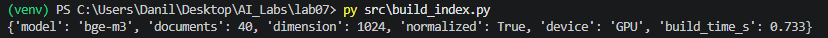
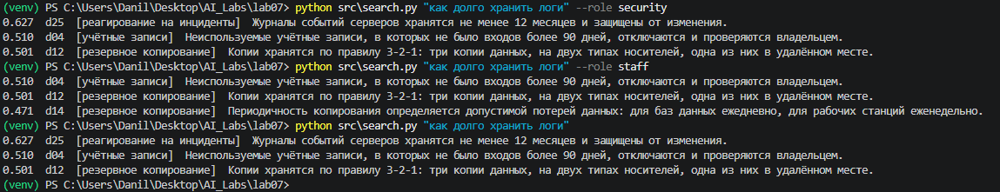
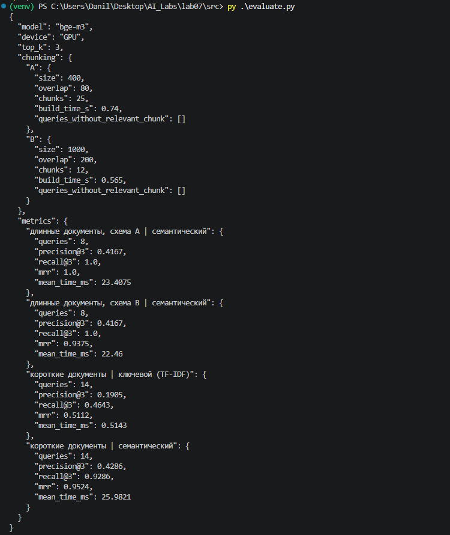

# ЛР7

**Цель работы**

Освоить воспроизводимый контур семантического поиска: подготовка корпуса документов → получение эмбеддингов → вычисление меры близости → выдача top-k результатов → оценка качества и производительности. Результат работы используется далее как основа для лабораторной по RAG.

**Описание модели эмбеддингов**

Эмбеддинг — это процесс преобразования объектов реального мира (слов, фраз, изображений, звуков, узлов графов и т. д.) в числовые векторы (массивы чисел), которые может понимать и с которыми может работать компьютер. Главная задача такого преобразования — сохранить смысловые связи между объектами: близкие по смыслу объекты получают близкие векторы в многомерном пространстве.  В работе используется модель bge-m3 (разработчик — BAAI), многоязычная модель эмбеддингов с размерностью вектора 1024; она запускается в Ollama. 

**Конфигурация компьютера**

| Параметр | Значение |
| --- | --- |
| Операционная система | Windows 11 LTSC IoT |
| Процессор | AMD Ryzen 5 5600 |
| Количество ядер / потоков | 6 / 12 |
| Оперативная память, ГБ | 32 |
| GPU | NVIDIA GeForce GTX 1080 Ti |
| Видеопамять, ГБ | 11 |
| Свободное место на диске, ГБ | 60 |
| Среда запуска моделей | Ollama (версия: 0.40.2) |
| Модель эмбеддингов | bge-m3 |
| Размерность вектора | 1024 |
| Нормализация | включена (векторы приводятся к длине 1) |
| Язык корпуса | русский |
| Дата эксперимента | 10.10.2026 |

**Способ доступа**

Эмбеддинги считает Ollama на этом же компьютере, обращение по http://127.0.0.1:11434, метод /api/embed. Поиск, TF-IDF и метрики выполняются на Python (NumPy, scikit-learn). Внешние сервисы не используются, тексты корпуса не покидают компьютер.

**Запуск**

Все команды выполняются в корне проекта. Установить зависимости:
```
python -m venv .venv
.venv\Scripts\activate
pip install -r requirements.txt
```
Скачать модель эмбеддингов и проверить, что сервер Ollama работает:
```
ollama pull bge-m3
ollama list
```
Создать .env на основе примера:
```
copy .env.example .env
```
Построить индекс (эмбеддинги корпуса), выполнить поиск и оценку:
```
python src\build_index.py
python src\search.py "что делать если украли пароль"
python src\evaluate.py
```

**Переменные окружения**
```
OLLAMA_URL=     # адрес Ollama, по умолчанию http://127.0.0.1:11434
EMBED_MODEL=    # имя модели эмбеддингов из ollama list (bge-m3)
TOP_K=          # сколько результатов считать в метриках и выдаче (3)
```


**Результаты**

в results/: corpus_vectors.npy (векторы корпуса), index_info.json (модель, размерность, устройство, время построения индекса), search_results.csv (результаты всех запросов по всем методам), metrics.json (сводные метрики).

**Структура**
```
lab07/
├── .env.example
├── requirements.txt
├── README.md
├── src/
│   ├── common.py
│   ├── build_index.py
│   ├── search.py
│   └── evaluate.py
├── data/
│   ├── corpus.jsonl
│   ├── queries.jsonl
│   ├── long_docs.jsonl
│   └── long_queries.jsonl
├── results/
│   ├── index_info.json
│   ├── search_results.csv
│   └── metrics.json
└── screenshots/
```

1. корпус (40 коротких документов) лежит в data/corpus.jsonl; у каждого документа есть id, category, access (кто имеет право его видеть) и text;
2. запросы с эталоном хранятся в data/queries.jsonl (14 запросов, в поле relevant — id верных документов;
3. common.py содержит получение эмбеддингов из Ollama, чтение данных и нарезку текста на фрагменты;
4. векторы нормализуются, поэтому косинусное сходство равно скалярному произведению (запрос и документы кодируются одной и той же моделью);
5. индекс — матрица NumPy N × D, поиск считает сходство запроса со всеми документами и берёт top-k; векторная база (FAISS, Qdrant) не использовалась, поскольку на 40 документах она не нужна;
6. ключевой поиск (базовая линия) — TF-IDF из scikit-learn по словам, без морфологии: «увольнение» и «уволенного» для него разные слова;
7. время поиска включает кодирование запроса моделью; перед замером выполняется один прогревочный запрос, потому что первое обращение к модели загружает её в память;
8. для эксперимента с фрагментами используются 4 длинных документа (data/long_docs.jsonl) и 8 вопросов (data/long_queries.jsonl); фрагмент считается верным, если содержит фразу-ответ (поле answer);
9. все данные синтетические, реальные пароли, ключи и персональные данные в корпусе отсутствуют.

**Ход работы**

Предметная область: регламенты информационной безопасности. Корпус состоит из 8 категорий по 5 документов: учётные записи, пароли и MFA, резервное копирование, обновления и уязвимости, реагирование на инциденты, фишинг и почта, сеть, физический доступ и устройства.

Часть запросов специально сформулирована без слов из документов (например, «как долго хранить логи» при документе о «журналах событий»), чтобы было видно различие между ключевым и семантическим поиском; часть содержит те же слова, что и документ.

Таблица 1. Параметры индекса (results/index_info.json)

| Параметр | Значение |
| --- | --- |
| Модель | bge-m3 |
| Размерность вектора | 1024 |
| Устройство | GPU |
| Нормализация | включена |
| Число документов | 40 |
| Время построения индекса, с | 0.73 |

Таблица 2. Результаты поиска по запросам (фрагмент results/search_results.csv)

| № | Запрос | Метод | Top-1 | Top-3 | Первый релевантный ранг | Время, мс |
| --- | --- | --- | --- | --- | --- | --- |
| 1 | что делать если украли пароль | ключевой | d27 | d27 d06 d08 | 1 | 0.52 |
| 1 | что делать если украли пароль | эмбеддинги | d27 | d27 d01 d08 | 1 | 22.97 |
| 2 | как проверить, что резервные копии действительно работают | ключевой | d13 | d13 d11 d12 | 2 | 0.52 |
| 2 | как проверить, что резервные копии действительно работают | эмбеддинги | d11 | d11 d13 d17 | 1 | 21.65 |
| 3 | как защититься от вируса-вымогателя, который шифрует файлы | ключевой | d30 | d30 d25 d19 | 28 | 0.49 |
| 3 | как защититься от вируса-вымогателя, который шифрует файлы | эмбеддинги | d30 | d30 d38 d15 | 3 | 22.18 |
| 4 | как быстро ставить патчи на серверы | ключевой | d18 | d18 d30 d11 | 1 | 0.47 |
| 4 | как быстро ставить патчи на серверы | эмбеддинги | d18 | d18 d16 d17 | 1 | 21.88 |
| 5 | как долго хранить логи | ключевой | d40 | d40 d39 d38 | 16 | 0.48 |
| 5 | как долго хранить логи | эмбеддинги | d25 | d25 d04 d12 | 1 | 23.26 |
| 6 | как работать с внутренними системами из дома | ключевой | d31 | d31 d19 d15 | 1 | 0.48 |
| 6 | как работать с внутренними системами из дома | эмбеддинги | d31 | d31 d35 d36 | 1 | 21.48 |
| 7 | что делать с компьютером, на котором обнаружен троян | ключевой | d18 | d18 d30 d11 | 27 | 0.48 |
| 7 | что делать с компьютером, на котором обнаружен троян | эмбеддинги | d22 | d22 d27 d38 | 1 | 21.34 |
| 8 | как вести себя при сомнительном письме | ключевой | d01 | d01 d39 d37 | 14 | 0.46 |
| 8 | как вести себя при сомнительном письме | эмбеддинги | d27 | d27 d26 d21 | 1 | 21.81 |
| 9 | защита от подбора пароля | ключевой | d09 | d09 d25 d19 | 1 | 0.46 |
| 9 | защита от подбора пароля | эмбеддинги | d09 | d09 d06 d01 | 1 | 25.02 |
| 10 | потеря рабочего телефона | ключевой | d39 | d39 d37 d40 | 2 | 0.45 |
| 10 | потеря рабочего телефона | эмбеддинги | d37 | d37 d21 d10 | 1 | 40.78 |
| 11 | увольнение сотрудника и его доступы | ключевой | d02 | d02 d10 d40 | 1 | 0.45 |
| 11 | увольнение сотрудника и его доступы | эмбеддинги | d02 | d02 d10 d27 | 1 | 35.28 |
| 12 | как утилизировать старые диски | ключевой | d38 | d38 d40 d39 | 2 | 0.44 |
| 12 | как утилизировать старые диски | эмбеддинги | d40 | d40 d38 d12 | 1 | 21.86 |
| 13 | кто может заходить в серверную комнату | ключевой | d40 | d40 d39 d38 | 5 | 0.44 |
| 13 | кто может заходить в серверную комнату | эмбеддинги | d36 | d36 d13 d31 | 1 | 21.12 |
| 14 | двухфакторная защита для администраторов | ключевой | d03 | d03 d13 d14 | 4 | 0.45 |
| 14 | двухфакторная защита для администраторов | эмбеддинги | d07 | d07 d31 d13 | 1 | 21.50 |

Таблица 3. Сводные метрики (results/metrics.json)

| Метод | Precision@3 | Recall@3 | MRR | Средняя задержка, мс |
| --- | --- | --- | --- | --- |
| Ключевой поиск (TF-IDF), короткие документы | 0.19 | 0.46 | 0.51 | 0.47 |
| Семантический поиск, короткие документы | 0.43 | 0.93 | 0.95 | 24.44 |
| Семантический поиск, длинные документы, схема A (400 / 80) | 0.42 | 1.00 | 1.00 | 26.88 |
| Семантический поиск, длинные документы, схема B (1000 / 200) | 0.42 | 1.00 | 0.94 | 27.30 |

Таблица 4. Эксперимент с размером фрагмента (4 длинных документа, 8 вопросов)

| Схема | Размер / перекрытие, символов | Число фрагментов | Время построения индекса, с | Precision@3 | Recall@3 | MRR |
| --- | --- | --- | --- | --- | --- | --- |
| A | 400 / 80 | 25 | 0.65 | 0.42 | 1.00 | 1.00 |
| B | 1000 / 200 | 12 | 0.47 | 0.42 | 1.00 | 0.94 |

Запросы, где семантический поиск выиграл или проиграл (по search_results.csv):

| Запрос | Что нашёл ключевой поиск (top-3, ранг первого верного) | Что нашёл семантический | Комментарий |
| --- | --- | --- | --- |
| 5. как долго хранить логи | d40 d39 d38 (16) | d25 d04 d12 (1) | «логи» и «журналы» — разные слова, общих слов с документом нет |
| 7. что делать с компьютером, на котором обнаружен троян | d18 d30 d11 (27) | d22 d27 d38 (1) | «компьютером» и «компьютер» для TF-IDF разные слова, а слова «троян» в документе нет (там «вредоносный файл») |
| 3. как защититься от вируса-вымогателя, который шифрует файлы | d30 d25 d19 (28) | d30 d38 d15 (3) | «вымогатель» и «шифрует файлы» — в документах нет этих слов; найден лишь один из двух верных |
| 8. как вести себя при сомнительном письме | d01 d39 d37 (14) | d27 d26 d21 (1) | «сомнительное письмо» против «подозрительного письма»: форма и синоним |
| 13. кто может заходить в серверную комнату | d40 d39 d38 (5) | d36 d13 d31 (1) | «серверная комната» и «серверные помещения» — разные слова |

Ограничения эксперимента: корпус маленький (40 документов, 14 запросов), метрики на нём приближённые и чувствительны к одному запросу; эталон субъективен; время поиска на 40 документах определяется в основном кодированием запроса; векторный индекс (FAISS, Qdrant) не сравнивался.






**Анализ информационной безопасности**

Пример запроса и результата:
```
python src\search.py "как долго хранить логи"
0.627  d25  [реагирование на инциденты]  Журналы событий серверов хранятся не менее 12 месяцев и защищены от изменения.
0.510  d04  [учётные записи]  Неиспользуемые учётные записи, в которых не было входов более 90 дней, отключаются и проверяются владельцем.
0.501  d12  [резервное копирование]  Копии хранятся по правилу 3-2-1: три копии данных, на двух типах носителей, одна из них в удалённом месте.
```
В запросе нет слова «журналы», но документ найден: сходство 0.627 против 0.510 и 0.501 у двух других.

Контроль доступа. Документы имеют поле access: all (доступны всем) и security (только службе ИБ). Поиск с ролью staff сначала отбрасывает документы с access=security и только потом считает сходство. На том же запросе у роли staff документа d25 (журналы событий, access=security) в выдаче нет, а на его место поднялся менее подходящий d14:
```
python src\search.py "как долго хранить логи" --role security
python src\search.py "как долго хранить логи" --role staff
```

Таблица 5. Данные и допустимость хранения и передачи

| Что хранится или передаётся | Риск | Мера |
| --- | --- | --- |
| Исходные документы корпуса | Утечка содержимого | Хранить в защищённом месте, права доступа по метаданным |
| Векторы документов (corpus_vectors.npy) | По вектору можно примерно восстановить смысл текста, вектор — не шифрование и не анонимизация | Давать к файлу такие же права, как к документам |
| Оценки сходства и метаданные в ответе | Раскрывают существование и тему закрытого документа | Не возвращать то, что пользователь не имеет права видеть |
| Запросы пользователей | Содержат конфиденциальные формулировки | Не отправлять во внешние сервисы без разрешения; журналы защищать |
| Ключи доступа к внешним сервисам | Утечка через репозиторий | Хранить только в переменных окружения, .env в .gitignore |

В работе тексты обрабатываются локальной моделью в Ollama и никуда не отправляются. Если использовать внешний API эмбеддингов, нужно отдельно зафиксировать, куда передаются тексты и что сохраняет поставщик.

Вопрос 6.1 (фильтрация прав доступа). Права следует применять на обоих этапах: до поиска (отбирать для сравнения только документы, к которым у пользователя есть доступ, как делает `--role staff`) и после поиска (повторно проверять права перед выдачей, на случай ошибки в метаданных или устаревших прав). Если фильтровать только после поиска, закрытые документы могут занять места в top-k, и пользователь получит неполный результат; кроме того, закрытые фрагменты уже участвовали в вычислениях. Риски утечки: через текст фрагмента, через метаданные (название и путь закрытого документа), через оценки сходства (по значению и порядку выдачи можно догадаться, что в индексе есть закрытый документ на эту тему), а при RAG — через ответ модели, составленный по закрытому фрагменту.

**Вывод**

На 14 запросах по 40 документам семантический поиск (bge-m3, Ollama, GPU) заметно превзошёл ключевой поиск TF-IDF: Precision@3 0.43 против 0.19, Recall@3 0.93 против 0.46, MRR 0.95 против 0.51. Максимум Precision@3 на этом эталоне равен 0.48 (у многих запросов один верный документ), поэтому 0.43 близко к потолку. Верный документ оказался на первом месте в 13 запросах из 14; у TF-IDF — в 5. Ключевой поиск проигрывал там, где в запросе нет слов документа или они стоят в другой форме: «логи» и «журналы событий» (ранг 16 против 1), «компьютер, на котором обнаружен троян» (27 против 1), «сомнительное письмо» (14 против 1). Там, где слова совпадали («как проверить, что резервные копии действительно работают», «как работать с внутренними системами из дома»), TF-IDF тоже находил верный документ в первых трёх. Ни в одном запросе TF-IDF не оказался лучше семантического поиска по рангу первого верного документа.

Семантический поиск не безошибочен: в запросе про вымогателя верный документ найден только на 3-м месте и найден один из двух верных (Recall 0.5), а в запросе про двухфакторную защиту администраторов пропущен документ про аппаратные ключи. Выше всех оказались документы той же темы, но не отвечающие на вопрос. Значение сходства (0.50–0.63) само по себе не показывает правильность: у верного и неверного документов оценки отличаются всего на 0.1.

Размер фрагмента на 4 длинных документах и 8 вопросах дал почти одинаковое качество: у схемы A (400 символов, 25 фрагментов) Recall@3 1.0 и MRR 1.0, у схемы B (1000 символов, 12 фрагментов) Recall@3 1.0 и MRR 0.94: в одном запросе верный фрагмент был вторым. Различие в один запрос из восьми на таких данных нельзя считать устойчивым выводом; крупные фрагменты содержат больше соседних тем, мелкие точнее попадают в факт, но теряют контекст. Построение индекса быстрее у схемы B (0.47 с против 0.65 с), потому что фрагментов меньше.

Время поиска: семантический поиск занимает в среднем около 24–27 мс, TF-IDF — около 0.5 мс; на 40 документах и на видеокарте разница не критична. Нагрузка на компьютер в этой работе минимальная, потому что модель мала, а корпус короткий. 


**Ответы на контрольные вопросы**

**1. Что представляет собой эмбеддинг и почему отдельная его координата обычно не интерпретируется?**

Эмбеддинг — числовой вектор фиксированной длины, которым модель представляет текст. Смысл закодирован во взаимном расположении векторов, а не в отдельных числах: модель обучается так, чтобы близкие по смыслу тексты оказывались рядом. Отдельная координата — это результат совместной работы множества параметров модели и не соответствует понятному признаку, поэтому осмысленно сравнивать целые векторы, а не их компоненты.

**2. Чем семантический поиск отличается от полнотекстового поиска?**

Полнотекстовый (ключевой) поиск ищет совпадения слов и их форм, а семантический сравнивает смысл запроса и документа через близость векторов. Поэтому семантический поиск находит синонимы и перефразировки («логи» и «журналы событий»), но хуже работает с точными идентификаторами и менее объясним: нельзя показать, какие слова совпали. Ключевой поиск быстр и объясним, но не находит текст, в котором нет слов запроса.

**3. Что измеряет косинусное сходство?**

Косинус угла между двумя векторами: сходство направлений независимо от их длины. Значение ближе к 1 означает более близкое направление, то есть более близкий смысл. Диапазон и распределение значений зависят от конкретной модели, поэтому единый порог «релевантно или нет» нельзя переносить между моделями без проверки на своих данных.

**4. Почему нельзя использовать произвольные модели для документов и запросов в одном индексе?**

Разные модели строят разные векторные пространства: даже при одинаковой размерности координаты в них означают разное, и сравнивать векторы из разных пространств бессмысленно. Поэтому документы и запросы кодируются одной моделью (или парой моделей, обученных работать вместе, иногда с разными префиксами для запроса и документа). При смене модели индекс нужно строить заново.

**5. Как размер фрагмента влияет на качество поиска?**

Слишком крупный фрагмент смешивает несколько тем, и его вектор «размывается», а слишком мелкий теряет контекст и может не содержать ответа целиком. Перекрытие соседних фрагментов помогает не разрезать нужную мысль. Оптимальный размер зависит от текста и запросов и подбирается экспериментом на своих данных (см. таблицу 4 и вывод).

**6. Зачем нужны метаданные документа?**

Чтобы знать источник и раздел фрагмента, ссылаться на него в ответе, фильтровать по категории, дате и автору и главное — применять права доступа: система должна не выдавать пользователю фрагменты, к которым у него нет доступа. Для RAG метаданные нужны ещё и для проверки ответа по источнику.

**7. Что показывают Precision@k, Recall@k и MRR?**

Precision@k — доля релевантных среди первых k результатов (чистота выдачи). Recall@k — доля найденных релевантных документов от всех релевантных для запроса (полнота). MRR — среднее значение 1/ранг первого релевантного результата по всем запросам; показывает, насколько высоко находится первый правильный ответ. Если для запроса только один верный документ, Precision@3 не превысит 1/3 даже при идеальном поиске, поэтому значения нужно трактовать с учётом числа верных документов.

**8. Почему высокий score сходства сам по себе не гарантирует правильность найденного фрагмента?**

Сходство показывает близость в пространстве модели, а не истинность или применимость текста: тематически близкий фрагмент может не отвечать на вопрос или противоречить ему (например, документ про смену пароля при вопросе о блокировке учётной записи). Шкала оценок зависит от модели и корпуса, а длинные или общие тексты могут получать высокие оценки без ответа. Поэтому качество проверяют на размеченных запросах, а не по величине score.

**9. Когда полезен гибридный поиск?**

Когда нужны и смысл, и точные совпадения: в запросах есть идентификаторы, коды ошибок, названия продуктов и редкие термины, которые семантическая модель может «сгладить», но в то же время запросы формулируются разными словами. Ключевой поиск (например, BM25) даёт точность по терминам, векторный — устойчивость к перефразированию; результаты объединяются (например, по рангам).

**10. Почему эмбеддинги нельзя считать способом анонимизации данных?**

Вектор сохраняет смысл исходного фрагмента, и по нему можно искать близкие тексты, а в ряде случаев приближённо восстанавливать содержание специальными моделями. Это не шифрование и не удаление идентифицирующих сведений, поэтому векторы нужно защищать так же, как исходные документы, а персональные данные — обезличивать до построения индекса.

**11. Какие ограничения возникают при переходе от сотен к миллионам векторов?**

Полный перебор по всем векторам становится медленным, нужны индексы приближённого поиска ближайших соседей (ANN), которые ускоряют поиск ценой небольшой потери точности и требуют настройки. Растут объём памяти для векторов и время построения и обновления индекса, появляются вопросы хранения метаданных, распределённости, фильтрации по правам и повторной индексации при смене модели.

**12. Как эта лабораторная связана с будущей RAG-системой?**

В RAG модель отвечает на вопрос по найденным фрагментам, и поиск (retrieval) определяет, какой контекст она получит. Нашедшиеся фрагменты, их границы и метаданные — результат этой работы. Если поиск вернул не те фрагменты, более сильная генеративная модель не исправит ответ, поэтому качество поиска, разбиение на фрагменты и контроль доступа проверяются до подключения генерации.
